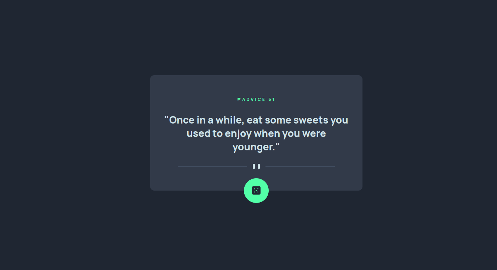

# Frontend Mentor - Advice generator app solution

This is a solution to the [Advice generator app challenge on Frontend Mentor](https://www.frontendmentor.io/challenges/advice-generator-app-QdUG-13db). Frontend Mentor challenges help you improve your coding skills by building realistic projects.

## Table of contents

  - [The challenge](#the-challenge)
  - [Screenshot](#screenshot)
  - [Links](#links)
- [My process](#my-process)
  - [Built with](#built-with)
  - [Continued development](#continued-development)

### The challenge

Users should be able to:

- View the optimal layout for the app depending on their device's screen size
- See hover states for all interactive elements on the page
- Generate a new piece of advice by clicking the dice icon

### Screenshot

### Links

- Front end Mentor Profile URL: [Here]((https://www.frontendmentor.io/profile/DennyIsNaive))
- Live Site URL: [Here](https://dennydoesfrontend.github.io/Random-Advice-Generator/)

## My process

I built out the layout with HTML and SCSS.
I went to the AdviceSlip website and read the documentation on how to use the API
After reading through the docs, I proceeded to work on the JavaScript part of the project and got it up and running.

### Built with

- HTML 5
-CSS
-Vanilla JS

### Continued development

I found APIs very interesting and cool to use. I intend to create more projects and explore different APIs and how they can make web apps more interesting.
